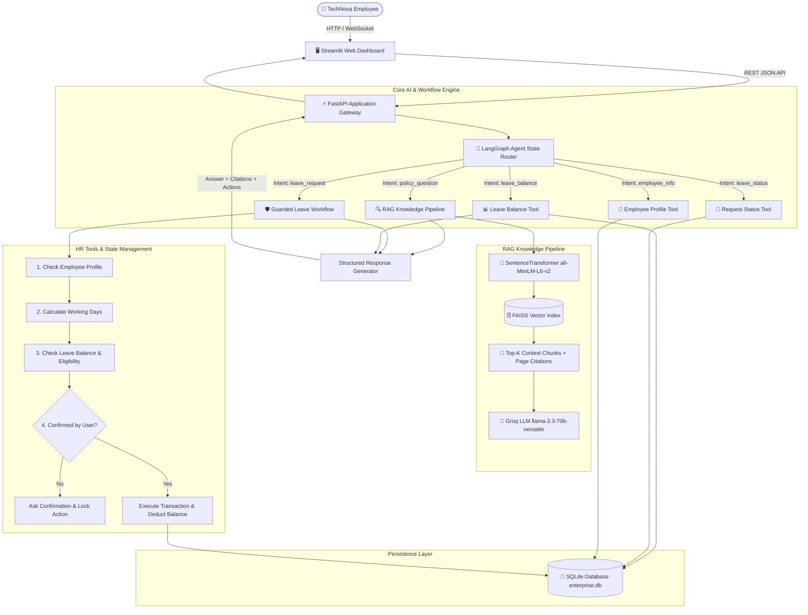
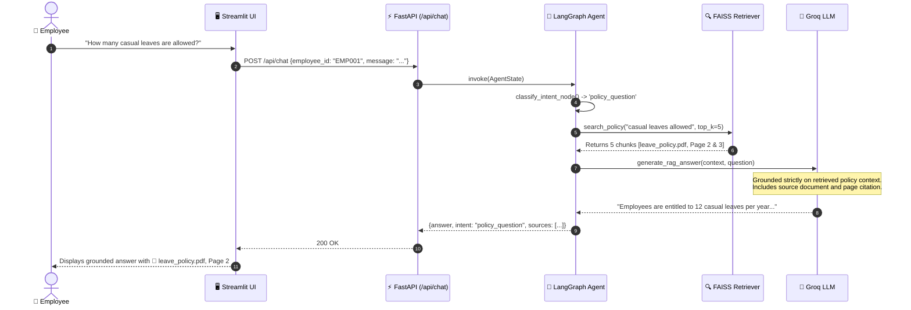
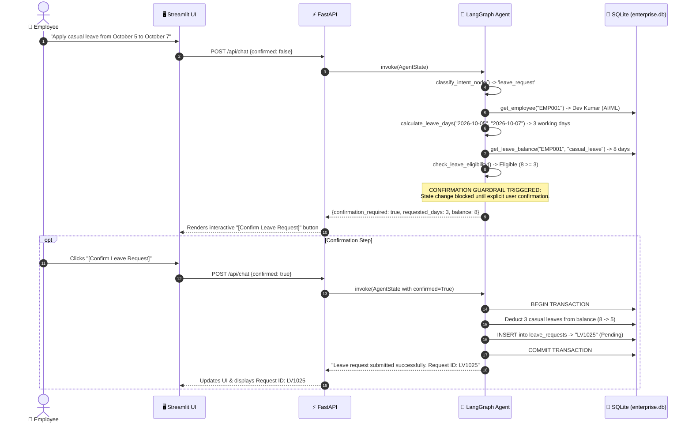
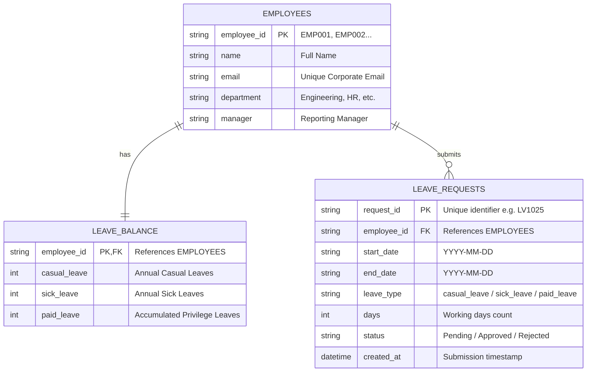

# Architecture & Technical Design — Enterprise Policy Assistant

This document outlines the architectural blueprint, data flows, and design decisions for the **TechNova Enterprise Policy Assistant**. This reference is designed for technical deep-dives and engineering interviews (e.g., TCS NQT / AI-ML / GenAI Specialist interviews).

---

## 1. High-Level System Architecture

The Enterprise Policy Assistant combines **Retrieval-Augmented Generation (RAG)** for company knowledge retrieval with a **controlled Agentic AI workflow (LangGraph)** for deterministic, stateful HR actions.

---

## 2. Core Conceptual Distinction (Interview Essentials)

In modern Generative AI engineering, a common question is distinguishing between **RAG**, **GenAI**, and **Agentic AI**. This project demonstrates all three in harmony:

| Concept | Core Responsibility | Implementation in TechNova Assistant |
| :--- | :--- | :--- |
| **RAG** (Retrieval-Augmented Generation) | **Retrieves external domain knowledge** that the model was never trained on, preventing factual hallucination. | Extracts, chunks, embeds 10 TechNova policy PDFs into FAISS; retrieves exact policy snippets with document and page numbers. |
| **GenAI** (Generative AI) | **Synthesizes natural-language answers** grounded in provided context. | Synthesizes professional, readable answers grounded strictly on retrieved policy excerpts via Groq API. |
| **Agentic AI** | **Autonomously reasons, plans, and selects tools** to accomplish multi-step goals with stateful execution. | The LangGraph state machine determines intent, checks employee eligibility, calculates working days, demands confirmation, and updates SQLite. |

---

## 3. End-to-End User Interaction Flows

### Flow A: Knowledge Policy Request (RAG)
Example: *"How many casual leaves are allowed?"*

### Flow B: HR Action Request with Confirmation Safety (Agentic AI)
Example: *"Apply casual leave from October 5 to October 7."*

---

## 4. Database Schema (Entity Relationship Diagram)

---

## 5. Security Guardrails & Enterprise Governance

1. **Strict Context Grounding**: The LLM system prompt forbids answering ungrounded queries. If documents lack the answer, the system replies: *"I could not find this information in the available company policy documents."*
2. **Deterministic State Changes**: State-changing database mutations (leave creation, balance deduction) are physically decoupled from direct LLM output. The LLM only classifies intent; Python code executes validated database transactions.
3. **Negative Balance Prevention**: The `check_leave_eligibility` and `create_leave_request` tools enforce that requested days strictly do not exceed current balances.
4. **Calendar Validation**: Automatically discounts weekends (Saturdays and Sundays) and verifies that `start_date <= end_date`.
5. **No Arbitrary SQL**: All database operations use SQLAlchemy ORM parameterization, completely eliminating SQL injection vectors.
6. **Zero Leaked Credentials**: Secret keys are loaded solely through environment variables (`.env`).
